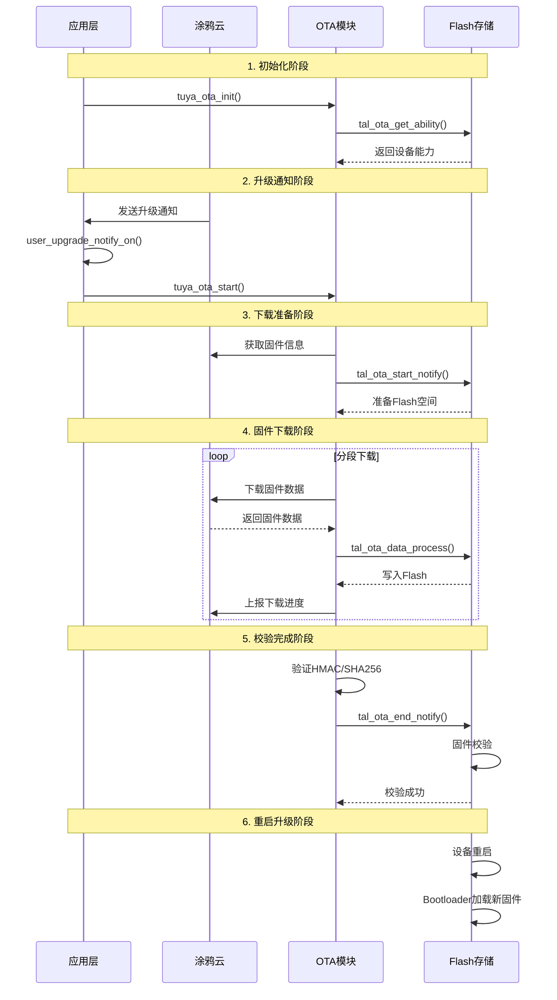

# TuyaOpen OTA升级功能学习指南

## 目录
1. [OTA概述](#ota概述)
2. [系统架构](#系统架构)
3. [核心API接口](#核心api接口)
4. [OTA交互流程](#ota交互流程)
5. [示例代码解析](#示例代码解析)
6. [Demo应用开发](#demo应用开发)
7. [最佳实践](#最佳实践)

## OTA概述

OTA（Over-The-Air）是TuyaOpen提供的固件远程升级功能，允许设备通过网络接收并安装新的固件版本，无需物理接触设备。

### 主要特性
- **多协议支持**：支持通过Wi-Fi、以太网、蓝牙等方式进行OTA升级
- **安全可靠**：内置HMAC和SHA256校验，确保固件完整性
- **灵活配置**：支持全量包和差分包升级
- **进度监控**：实时上报升级进度和状态
- **断点续传**：支持网络中断后的断点续传功能

## 系统架构

TuyaOpen OTA系统采用分层架构设计：

```
┌─────────────────────────────────────────┐
│            应用层 (Application)          │
│         用户回调函数 & 事件处理           │
├─────────────────────────────────────────┤
│          云服务层 (Cloud Service)        │
│    tuya_ota.c - OTA核心逻辑处理          │
├─────────────────────────────────────────┤
│           抽象层 (TAL Layer)            │
│        tal_ota.h - 统一API接口          │
├─────────────────────────────────────────┤
│          硬件抽象层 (TKL Layer)          │
│      tkl_ota.c - 平台相关实现           │
└─────────────────────────────────────────┘
```

### 关键组件

#### 1. OTA云服务模块 (`tuya_ota.c`)
- 处理云端OTA请求
- 管理固件下载过程
- 状态上报和进度监控

#### 2. TAL OTA接口 (`tal_ota.h`)
- 提供统一的OTA API接口
- 屏蔽不同平台的差异

#### 3. TKL OTA实现 (`tkl_ota.c`)
- 平台相关的具体实现
- Flash操作和固件写入

## 核心API接口

### 数据结构

#### OTA配置结构
```c
typedef struct {
    void *client;                    // IoT客户端句柄
    tuya_ota_event_cb_t event_cb;   // 事件回调函数
    size_t range_size;              // 分段下载大小 (建议4096)
    uint32_t timeout_ms;            // 超时时间 (建议5000ms)
    void *user_data;                // 用户自定义数据
} tuya_ota_config_t;
```

#### OTA数据包结构
```c
typedef struct {
    uint32_t total_len;    // OTA固件总长度
    uint32_t offset;       // 当前数据偏移量
    uint8_t *data;         // 数据指针
    uint32_t len;          // 当前数据长度
    void *pri_data;        // 私有数据指针
    uint32_t start_addr;   // Flash起始地址
} TUYA_OTA_DATA_T;
```

#### OTA类型和路径
```c
typedef enum {
    TUYA_OTA_FULL = 1,    // 全量包升级
    TUYA_OTA_DIFF = 2,    // 差分包升级
} TUYA_OTA_TYPE_E;

typedef enum {
    TUYA_OTA_PATH_AIR = 0,      // 通过网络升级
    TUYA_OTA_PATH_UART = 1,     // 通过串口升级
    TUYA_OTA_PATH_BLE = 2,      // 通过蓝牙升级
    TUYA_OTA_PATH_ZIGBEE = 3,   // 通过Zigbee升级
} TUYA_OTA_PATH_E;
```

### 主要API函数

#### 1. OTA初始化
```c
/**
 * @brief 初始化OTA模块
 * 
 * @param config OTA配置参数
 * @return OPRT_OK 成功，其他值表示错误
 */
int tuya_ota_init(tuya_ota_config_t *config);
```

#### 2. 获取OTA能力
```c
/**
 * @brief 获取设备OTA能力
 * 
 * @param image_size 最大支持的固件大小
 * @param type 支持的OTA类型
 * @return OPRT_OK 成功，其他值表示错误
 */
OPERATE_RET tal_ota_get_ability(uint32_t *image_size, TUYA_OTA_TYPE_E *type);
```

#### 3. OTA开始通知
```c
/**
 * @brief OTA开始通知
 * 
 * @param image_size 固件大小
 * @param type OTA类型
 * @param path 传输路径
 * @return OPRT_OK 成功，其他值表示错误
 */
OPERATE_RET tal_ota_start_notify(uint32_t image_size, TUYA_OTA_TYPE_E type, TUYA_OTA_PATH_E path);
```

#### 4. OTA数据处理
```c
/**
 * @brief 处理OTA数据
 * 
 * @param pack OTA数据包
 * @param remain_len 剩余数据长度
 * @return OPRT_OK 成功，其他值表示错误
 */
OPERATE_RET tal_ota_data_process(TUYA_OTA_DATA_T *pack, uint32_t *remain_len);
```

#### 5. OTA结束通知
```c
/**
 * @brief OTA结束通知
 * 
 * @param reset 是否需要重启设备
 * @return OPRT_OK 成功，其他值表示错误
 */
OPERATE_RET tal_ota_end_notify(BOOL_T reset);
```

## OTA交互流程

### 完整OTA升级流程



### 状态码说明

#### 升级状态码
```c
#define TUS_RD           1    // 准备状态
#define TUS_UPGRDING     2    // 升级中
#define TUS_UPGRD_FINI   3    // 升级完成
#define TUS_UPGRD_EXEC   4    // 升级失败

// 扩展状态码
#define TUS_DOWNLOAD_START    10    // 开始下载
#define TUS_DOWNLOAD_COMPLETE 11    // 下载完成
#define TUS_UPGRADE_START     12    // 开始升级
#define TUS_UPGRADE_SUCCESS   3     // 升级成功
```

#### 错误状态码
```c
#define TUS_DOWNLOAD_ERROR_UNKONW             40    // 未知错误
#define TUS_DOWNLOAD_ERROR_LOW_BATTERY        41    // 电池电量低
#define TUS_DOWNLOAD_ERROR_STORAGE_NOT_ENOUGH 42    // 存储空间不足
#define TUS_DOWNLOAD_ERROR_MALLOC_FAIL        43    // 内存分配失败
#define TUS_DOWNLOAD_ERROR_TIMEOUT            44    // 下载超时
#define TUS_DOWNLOAD_ERROR_HMAC               45    // HMAC校验失败
#define TUS_UPGRADE_ERROR_LOW_BATTERY         46    // 升级时电池电量低
#define TUS_UPGRADE_ERROR_MALLOC_FAIL         47    // 升级时内存分配失败
#define TUS_UPGRADE_ERROR_VERSION             48    // 版本错误
#define TUS_UPGRADE_ERROR_HMAC                49    // 升级时HMAC校验失败
```

## 示例代码解析

### switch_demo中的OTA实现

#### 1. OTA升级通知处理
```c
void user_upgrade_notify_on(tuya_iot_client_t *client, cJSON *upgrade)
{
    PR_INFO("----- Upgrade information -----");
    PR_INFO("OTA Channel: %d", cJSON_GetObjectItem(upgrade, "type")->valueint);
    PR_INFO("Version: %s", cJSON_GetObjectItem(upgrade, "version")->valuestring);
    PR_INFO("Size: %s", cJSON_GetObjectItem(upgrade, "size")->valuestring);
    PR_INFO("MD5: %s", cJSON_GetObjectItem(upgrade, "md5")->valuestring);
    PR_INFO("HMAC: %s", cJSON_GetObjectItem(upgrade, "hmac")->valuestring);
    PR_INFO("URL: %s", cJSON_GetObjectItem(upgrade, "url")->valuestring);
    PR_INFO("HTTPS URL: %s", cJSON_GetObjectItem(upgrade, "httpsUrl")->valuestring);
}
```

#### 2. 事件处理器中的OTA事件
```c
void user_event_handler_on(tuya_iot_client_t *client, tuya_event_msg_t *event)
{
    switch (event->id) {
    case TUYA_EVENT_UPGRADE_NOTIFY:
        // 接收到OTA升级通知
        user_upgrade_notify_on(client, event->value.asJSON);
        break;
        
    case TUYA_EVENT_TIMESTAMP_SYNC:
        // 时间同步事件
        tal_time_set_posix(event->value.asInteger, 1);
        break;
        
    // 其他事件处理...
    }
}
```

#### 3. IoT客户端初始化
```c
// 初始化TuyaIoT客户端，包含OTA配置
ret = tuya_iot_init(&client, &(const tuya_iot_config_t){
    .software_ver = PROJECT_VERSION,
    .productkey = TUYA_PRODUCT_KEY,
    .uuid = license.uuid,
    .authkey = license.authkey,
    .event_handler = user_event_handler_on,  // 设置事件处理器
    .network_check = user_network_check,
});
```

### OTA核心逻辑解析 (`tuya_ota.c`)

#### 1. 文件下载事件处理
```c
static void file_download_event_cb(http_download_event_id_t id, http_download_event_t *event)
{
    tuya_ota_t *ota = (tuya_ota_t *)event->user_data;
    
    switch (id) {
    case DL_EVENT_START:
        // 开始下载
        tuya_ota_upgrade_status_report(ota, TUS_UPGRDING);
        tal_sha256_create_init(&ota->sha256);
        break;
        
    case DL_EVENT_ON_FILESIZE:
        // 获取文件大小
        tal_ota_start_notify(event->file_size, TUYA_OTA_FULL, TUYA_OTA_PATH_AIR);
        break;
        
    case DL_EVENT_ON_DATA:
        // 接收数据
        TUYA_OTA_DATA_T ota_pack;
        ota_pack.total_len = event->file_size;
        ota_pack.offset = event->offset;
        ota_pack.data = event->data;
        ota_pack.len = event->data_len;
        tal_ota_data_process(&ota_pack, (uint32_t *)&event->remain_len);
        break;
        
    case DL_EVENT_FINISH:
        // 下载完成，验证HMAC
        tal_sha256_finish_ret(ota->sha256, file_hmac);
        if (memcmp(self_hmac, file_hmac, 32) == 0) {
            tuya_ota_upgrade_status_report(ota, TUS_UPGRD_FINI);
            tal_ota_end_notify(TRUE);
        }
        break;
    }
}
```

## Demo应用开发

### 创建一个简单的OTA Demo

#### 1. 项目结构
```
ota_demo/
├── src/
│   ├── main.c              // 主程序
│   ├── ota_handler.c       // OTA处理逻辑
│   └── ota_handler.h       // OTA处理头文件
├── include/
│   └── app_config.h        // 应用配置
└── CMakeLists.txt          // 构建配置
```

#### 2. main.c - 主程序实现
```c
#include "tuya_iot.h"
#include "ota_handler.h"

// 设备配置
#define PROJECT_VERSION     "1.0.0"
#define PRODUCT_KEY         "your_product_key"
#define DEVICE_UUID         "your_device_uuid"
#define DEVICE_AUTH_KEY     "your_auth_key"

// 全局变量
tuya_iot_client_t g_client;

// 网络检查回调
bool network_check_callback(void)
{
    // 实现网络状态检查逻辑
    return true; // 简化实现，总是返回连接状态
}

// 事件处理回调
void event_handler_callback(tuya_iot_client_t *client, tuya_event_msg_t *event)
{
    switch (event->id) {
    case TUYA_EVENT_MQTT_CONNECTED:
        PR_INFO("MQTT连接成功");
        break;
        
    case TUYA_EVENT_UPGRADE_NOTIFY:
        // 处理OTA升级通知
        handle_ota_upgrade_notify(client, event->value.asJSON);
        break;
        
    case TUYA_EVENT_TIMESTAMP_SYNC:
        // 同步时间戳
        tal_time_set_posix(event->value.asInteger, 1);
        break;
        
    default:
        break;
    }
}

int main(void)
{
    int ret;
    
    // 初始化系统组件
    tal_log_init(TAL_LOG_LEVEL_DEBUG, 1024, (TAL_LOG_OUTPUT_CB)printf);
    tal_kv_init(&(tal_kv_cfg_t){
        .seed = "demo_seed_string",
        .key = "demo_key_string",
    });
    tal_sw_timer_init();
    tal_workq_init();
    
    // 初始化OTA处理器
    ota_handler_init();
    
    // 初始化TuyaIoT客户端
    ret = tuya_iot_init(&g_client, &(const tuya_iot_config_t){
        .software_ver = PROJECT_VERSION,
        .productkey = PRODUCT_KEY,
        .uuid = DEVICE_UUID,
        .authkey = DEVICE_AUTH_KEY,
        .event_handler = event_handler_callback,
        .network_check = network_check_callback,
    });
    
    if (ret != OPRT_OK) {
        PR_ERR("TuyaIoT初始化失败: %d", ret);
        return -1;
    }
    
    // 启动IoT服务
    tuya_iot_start(&g_client);
    
    // 主循环
    while (1) {
        tuya_iot_yield(&g_client);
        tal_system_sleep(10);
    }
    
    return 0;
}
```

#### 3. ota_handler.c - OTA处理逻辑
```c
#include "ota_handler.h"
#include "tuya_iot.h"

// OTA事件回调函数
static void ota_event_callback(tuya_ota_msg_t *msg, tuya_ota_event_t *event)
{
    switch (event->id) {
    case TUYA_OTA_EVENT_START:
        PR_INFO("OTA开始下载，文件大小: %zu", event->file_size);
        break;
        
    case TUYA_OTA_EVENT_ON_DATA:
        PR_DEBUG("接收OTA数据: offset=%zu, len=%zu", event->offset, event->data_len);
        // 这里可以添加自定义的数据处理逻辑
        break;
        
    case TUYA_OTA_EVENT_FINISH:
        PR_INFO("OTA下载完成");
        break;
        
    case TUYA_OTA_EVENT_FAULT:
        PR_ERR("OTA下载出错");
        break;
        
    default:
        break;
    }
}

void ota_handler_init(void)
{
    // 获取IoT客户端句柄
    tuya_iot_client_t *client = tuya_iot_client_get();
    
    // 配置OTA参数
    tuya_ota_config_t ota_config = {
        .client = client,
        .event_cb = ota_event_callback,
        .range_size = 4096,        // 4KB分段下载
        .timeout_ms = 10000,       // 10秒超时
        .user_data = NULL,
    };
    
    // 初始化OTA模块
    int ret = tuya_ota_init(&ota_config);
    if (ret != OPRT_OK) {
        PR_ERR("OTA初始化失败: %d", ret);
    } else {
        PR_INFO("OTA初始化成功");
    }
}

void handle_ota_upgrade_notify(tuya_iot_client_t *client, cJSON *upgrade_info)
{
    if (!upgrade_info) {
        PR_ERR("OTA升级信息为空");
        return;
    }
    
    // 解析升级信息
    cJSON *type_item = cJSON_GetObjectItem(upgrade_info, "type");
    cJSON *version_item = cJSON_GetObjectItem(upgrade_info, "version");
    cJSON *size_item = cJSON_GetObjectItem(upgrade_info, "size");
    cJSON *md5_item = cJSON_GetObjectItem(upgrade_info, "md5");
    cJSON *hmac_item = cJSON_GetObjectItem(upgrade_info, "hmac");
    cJSON *url_item = cJSON_GetObjectItem(upgrade_info, "httpsUrl");
    
    if (!type_item || !version_item || !size_item || !url_item) {
        PR_ERR("OTA升级信息不完整");
        return;
    }
    
    // 打印升级信息
    PR_INFO("========== OTA升级信息 ==========");
    PR_INFO("升级通道: %d", type_item->valueint);
    PR_INFO("目标版本: %s", version_item->valuestring);
    PR_INFO("固件大小: %s 字节", size_item->valuestring);
    
    if (md5_item) {
        PR_INFO("MD5校验: %s", md5_item->valuestring);
    }
    if (hmac_item) {
        PR_INFO("HMAC校验: %s", hmac_item->valuestring);
    }
    
    PR_INFO("下载地址: %s", url_item->valuestring);
    PR_INFO("================================");
    
    // 检查版本是否需要升级
    if (strcmp(version_item->valuestring, PROJECT_VERSION) <= 0) {
        PR_WARN("目标版本不高于当前版本，跳过升级");
        return;
    }
    
    // 检查可用存储空间
    uint32_t file_size = atol(size_item->valuestring);
    if (!check_storage_space(file_size)) {
        PR_ERR("存储空间不足，无法进行OTA升级");
        return;
    }
    
    // 开始OTA升级
    PR_INFO("开始OTA升级过程...");
    int ret = tuya_ota_start(upgrade_info);
    if (ret != OPRT_OK) {
        PR_ERR("启动OTA升级失败: %d", ret);
    }
}

static bool check_storage_space(uint32_t required_size)
{
    // 获取设备OTA能力
    uint32_t max_image_size;
    TUYA_OTA_TYPE_E ota_type;
    
    int ret = tal_ota_get_ability(&max_image_size, &ota_type);
    if (ret != OPRT_OK) {
        PR_ERR("获取OTA能力失败");
        return false;
    }
    
    PR_INFO("设备最大支持固件大小: %u 字节", max_image_size);
    PR_INFO("支持的OTA类型: %s", 
            (ota_type & TUYA_OTA_FULL) ? "全量包" : "差分包");
    
    if (required_size > max_image_size) {
        PR_ERR("固件大小(%u)超过设备支持的最大值(%u)", 
               required_size, max_image_size);
        return false;
    }
    
    return true;
}
```

#### 4. ota_handler.h - OTA处理头文件
```c
#ifndef __OTA_HANDLER_H__
#define __OTA_HANDLER_H__

#include "tuya_cloud_types.h"
#include "cJSON.h"

#ifdef __cplusplus
extern "C" {
#endif

/**
 * @brief 初始化OTA处理器
 */
void ota_handler_init(void);

/**
 * @brief 处理OTA升级通知
 * 
 * @param client IoT客户端句柄
 * @param upgrade_info 升级信息JSON对象
 */
void handle_ota_upgrade_notify(tuya_iot_client_t *client, cJSON *upgrade_info);

/**
 * @brief 检查存储空间是否足够
 * 
 * @param required_size 需要的存储空间大小
 * @return true 空间足够，false 空间不足
 */
static bool check_storage_space(uint32_t required_size);

#ifdef __cplusplus
}
#endif

#endif /* __OTA_HANDLER_H__ */
```

### 编译和运行

#### 1. CMakeLists.txt 配置
```cmake
cmake_minimum_required(VERSION 3.10)

project(ota_demo)

# 设置C标准
set(CMAKE_C_STANDARD 99)

# 添加TuyaOpen路径
set(TUYA_OPEN_SDK_PATH ${CMAKE_CURRENT_SOURCE_DIR}/../..)

# 包含头文件路径
include_directories(
    ${CMAKE_CURRENT_SOURCE_DIR}/include
    ${TUYA_OPEN_SDK_PATH}/src/tuya_cloud_service/cloud
    ${TUYA_OPEN_SDK_PATH}/src/tal_system/include
)

# 添加源文件
file(GLOB_RECURSE SOURCES "src/*.c")

# 生成可执行文件
add_executable(${PROJECT_NAME} ${SOURCES})

# 链接TuyaOpen库
target_link_libraries(${PROJECT_NAME} 
    tuya_cloud_service
    tal_system
)
```

#### 2. 编译命令
```bash
# 进入demo目录
cd ota_demo

# 创建build目录
mkdir build && cd build

# 配置编译
cmake ..

# 编译
make

# 运行
./ota_demo
```

## 最佳实践

### 1. 安全性考虑

#### 固件完整性验证
```c
// 在OTA过程中启用HMAC验证
static bool verify_firmware_integrity(const char *hmac_expected, 
                                     const uint8_t *firmware_data, 
                                     size_t data_len)
{
    uint8_t calculated_hmac[32];
    uint8_t expected_hmac[32];
    
    // 计算固件HMAC
    tal_sha256_mac(client->activate.seckey, 
                   strlen(client->activate.seckey),
                   firmware_data, data_len, 
                   calculated_hmac);
    
    // 转换期望的HMAC
    ascs2hex(expected_hmac, (uint8_t *)hmac_expected, FW_HMAC_LEN);
    
    // 比较HMAC
    return (memcmp(expected_hmac, calculated_hmac, 32) == 0);
}
```

#### 电池电量检查
```c
// 在开始OTA前检查电池电量
static bool check_battery_level(void)
{
    uint32_t battery_level = get_battery_percentage();
    
    if (battery_level < 30) {  // 电量低于30%
        PR_WARN("电池电量过低(%u%%)，延迟OTA升级", battery_level);
        return false;
    }
    
    return true;
}
```

### 2. 错误处理

#### 网络异常处理
```c
static void handle_download_error(int error_code)
{
    switch (error_code) {
    case TUS_DOWNLOAD_ERROR_TIMEOUT:
        PR_ERR("下载超时，请检查网络连接");
        // 可以实现重试逻辑
        break;
        
    case TUS_DOWNLOAD_ERROR_STORAGE_NOT_ENOUGH:
        PR_ERR("存储空间不足");
        // 清理临时文件或提示用户
        break;
        
    case TUS_DOWNLOAD_ERROR_HMAC:
        PR_ERR("固件校验失败，可能文件已损坏");
        break;
        
    default:
        PR_ERR("未知下载错误: %d", error_code);
        break;
    }
    
    // 上报错误状态到云端
    tuya_ota_upgrade_status_report(ota_handle, error_code);
}
```

### 3. 性能优化

#### 分段下载优化
```c
// 根据网络状况动态调整下载分段大小
static size_t get_optimal_range_size(void)
{
    uint32_t network_speed = get_network_speed();
    
    if (network_speed > 1000000) {      // > 1Mbps
        return 8192;   // 8KB
    } else if (network_speed > 100000) { // > 100Kbps
        return 4096;   // 4KB
    } else {
        return 2048;   // 2KB
    }
}
```

#### 内存管理
```c
// 优化内存使用，避免大块内存分配
static void process_ota_data_chunk(uint8_t *data, size_t len)
{
    const size_t CHUNK_SIZE = 1024;  // 1KB块处理
    size_t processed = 0;
    
    while (processed < len) {
        size_t chunk_len = (len - processed > CHUNK_SIZE) ? 
                          CHUNK_SIZE : (len - processed);
        
        // 处理数据块
        process_data_block(data + processed, chunk_len);
        processed += chunk_len;
        
        // 让出CPU时间，避免长时间占用
        tal_system_sleep(1);
    }
}
```

### 4. 日志和调试

#### 详细日志记录
```c
// 完整的OTA过程日志
void log_ota_progress(const char *stage, uint32_t progress, uint32_t total)
{
    static uint32_t last_progress = 0;
    uint32_t percentage = (progress * 100) / total;
    
    // 只在进度变化超过5%时打印日志
    if (percentage - last_progress >= 5) {
        PR_INFO("[OTA_%s] 进度: %u/%u (%u%%)", 
                stage, progress, total, percentage);
        last_progress = percentage;
    }
}
```

### 5. 用户体验

#### LED指示灯状态
```c
// 使用LED指示OTA状态
void update_ota_led_status(int ota_status)
{
    switch (ota_status) {
    case TUS_UPGRDING:
        // 蓝色闪烁 - 下载中
        set_led_blink(LED_BLUE, 500);
        break;
        
    case TUS_UPGRD_FINI:
        // 绿色常亮 - 升级成功
        set_led_solid(LED_GREEN);
        break;
        
    case TUS_UPGRD_EXEC:
        // 红色闪烁 - 升级失败
        set_led_blink(LED_RED, 200);
        break;
        
    default:
        // 关闭LED
        set_led_off();
        break;
    }
}
```

## 总结

TuyaOpen的OTA功能为IoT设备提供了强大而灵活的固件升级能力。通过本指南，开发者可以：

1. **理解OTA架构**：掌握TuyaOpen OTA系统的分层设计和核心组件
2. **使用核心API**：正确调用OTA相关的API接口
3. **实现完整流程**：按照标准流程实现OTA功能
4. **开发实际应用**：基于示例代码开发自己的OTA应用
5. **遵循最佳实践**：确保安全性、稳定性和用户体验

在实际开发中，建议先从简单的demo开始，逐步添加错误处理、安全验证和性能优化功能，最终实现一个完整可靠的OTA升级系统。 